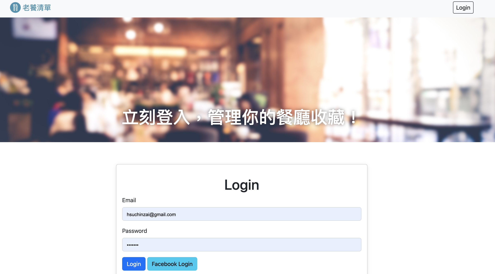
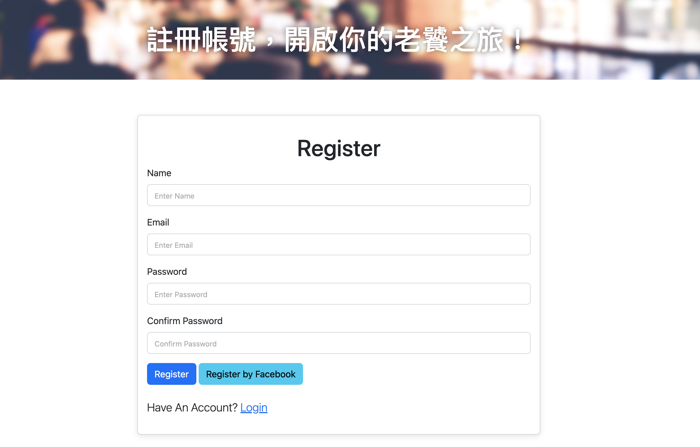
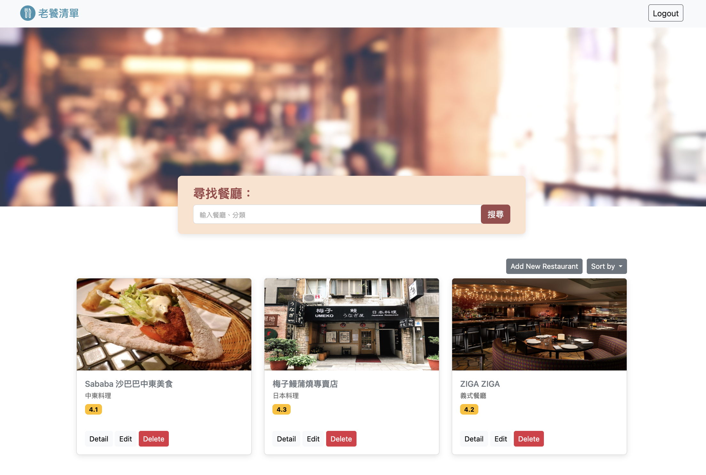
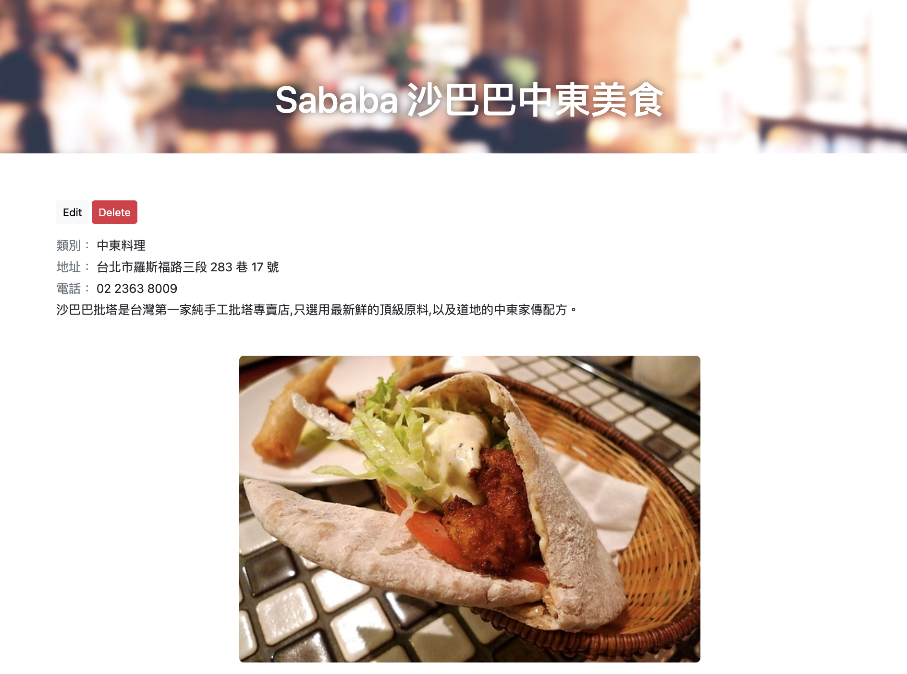

# 我的餐廳清單

老饕們的餐廳收藏清單，提供收藏、瀏覽及搜尋餐廳詳細資訊，如：餐廳類別、餐廳地址、餐廳電話等

## 功能說明

* 提供個人帳密註冊、登入，並支援使用Facebook登入
* 各帳號管理獨立的餐廳清單
* 可建立、修改、刪除餐廳檔案
* 可搜尋餐廳名稱，提供排序功能
* 點選各餐廳卡片，可瀏覽餐廳詳細資料


## 安裝與執行

1. 安裝node.js and npm
2. 複製專案到本機: git clone https://github.com/pupss91090/restaurant_guide.git
3. 進入專案資料夾: cd restaurant_guide
4. 安裝套件: npm install
5. 設定環境變數: 將.env.example檔案改為.env，修改MongoDB連線字串及FACEBOOK應用程式資料
6. 建立帳務類別種子資料: npm run seed
7. 啟動專案: npm run start
7. 看到以下訊息，可至瀏覽器輸入下列網址開啟
```
   `Express is running on http://localhost:3000` 
```
8. 登入種子帳號 
```
email: 'user1@example.com'  
password: '12345678'
```
   或建立帳號，登入後即可開始管理餐廳清單

## 畫面截圖










## 開發工具

- VS Code 
- Node 14.21.3
- Boostrap 5.2.3
- mongoose: 5.13.17
- bcryptjs: 2.4.3
- body-parser: 1.20.2
- connect-flash: 0.1.1
- express: 4.18.2
- express-handlebars: 3.0.0
- express-session: 1.17.3
- method-override: 3.0.0
- passport: 0.4.1
- passport-facebook: 3.0.0
- passport-local: 1.0.0